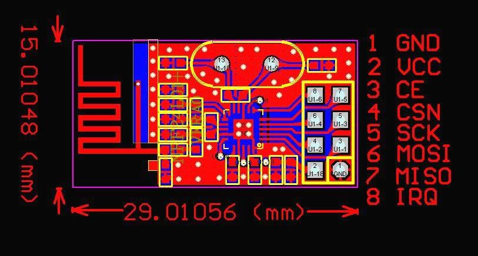
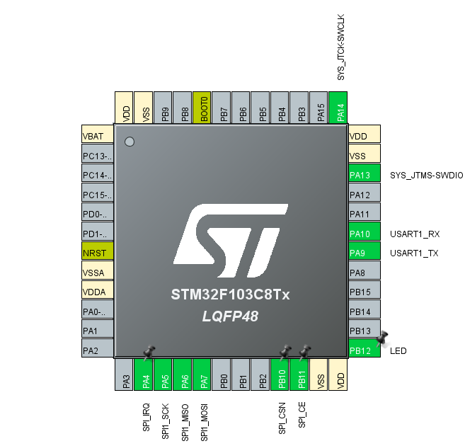
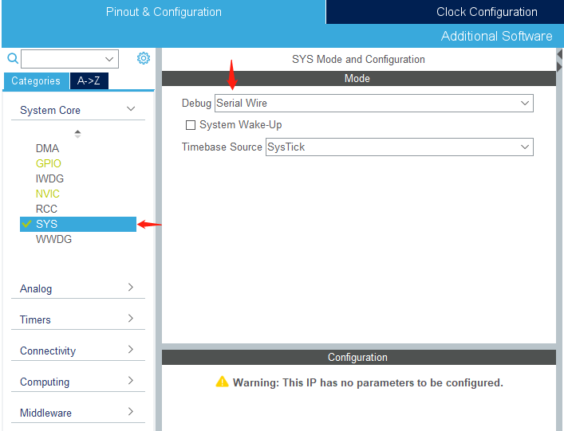
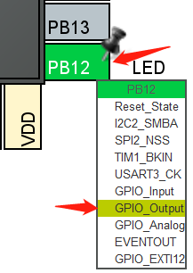
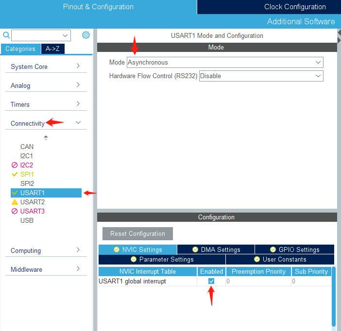
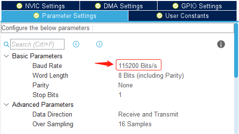
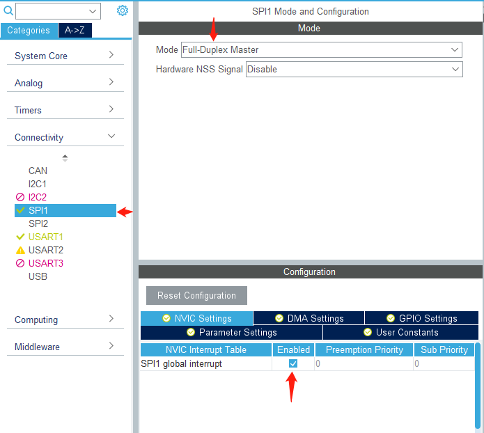
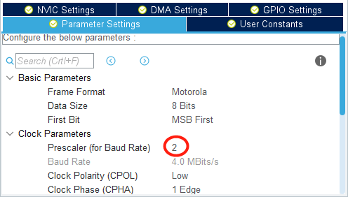
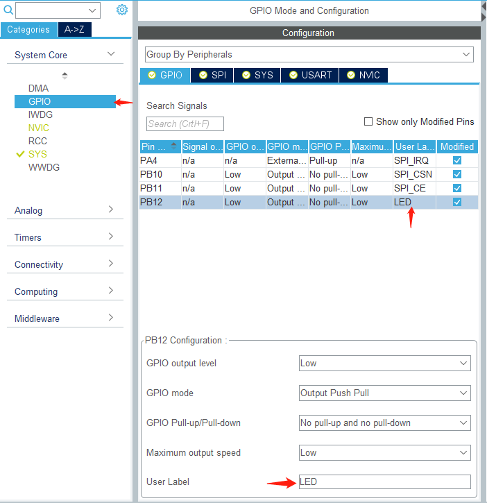
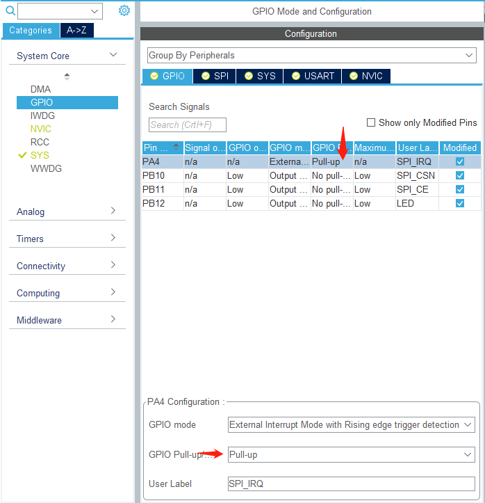

# Readme

照着csdn博客[传送门](https://blog.csdn.net/qq_36075612/article/details/103027490)（原博客应该是模仿了正点原子的教材）抄的STM32与nRF24L01无线模块的例程，实现板间通讯。

本人使用的开发板为STM32F103C8T6，开发环境为CubeIDE。

需要注意的点：

- 需要自己在CubeMX中配置SPI的CE CSN IRC引脚绑定，其中CSN和CE都是GPIO_Output, IRC是GPIO_External_Interrupt。
- 根据自己配置的引脚编号调整`urf24l01.h`中定义如上引脚的宏。
- 必须发射端与接收端同时启动才能工作，如果只有发射端没有接收端，则发送函数会一直返回错误标志"达到最大重发次数"。


## 操作说明

### 硬件连接及引脚配置

nRF24L01模块与MCU的通讯方式为SPI总线通讯，模块上的8个引脚与单片机的8个引脚要一一对应，分别为：`VCC(3.3V) GND CSN CE SCK MISO MOSI IRQ`。在本案例中，单片机作为主机，nRF模块作为从机，因此`MISO MOSI`两根线采用**平行**接法（如果是两块单片机板间通讯才需要交叉接法）。

模块的引脚对应见资料图：



单片机的引脚需要自行配置，配置方法如下：

> 在本例中采用单片机为STM32F103C8T6，用到了`USART1`（串口）与`SPI1`（SPI总线）。`USART1`对应的引脚为PA9与PA10，`SPI1`对应的SCK MOSI MISO引脚为PA5 PA6 PA7，另外三个引脚CE CSN IRQ需要自行配置。在本例中串口的作用是单片机与电脑之间的通讯，用于在电脑上展示无线模块收发的信息以及工作状态。

本例采用CubeIDE作为编程环境，新建工程，并在`.ioc`的CubeMX配置界面操作。

最终配置效果如图：



配置步骤：

在配置界面选择`Pinout & Configuration`，并在左侧界面以及芯片图上进行操作。

**1.  配置SWD烧写程序**

界面左侧System Core->SYS，选择Debug模式为`Serial Wire`。选择完成后PA13与PA14引脚配置完毕。



**2. 配置板载LED**

根据核心板原理图，板载LED对应引脚为PB12，直接在芯片图中点击PB12选择模式为`GPIO Output`即可。



**3. 配置串口USART1**

界面左侧选择Connectivity->USART1，选择Mode为`Asynchronous`，Hardware Flow Control默认`Disable`，在下方选择NVIC Settings选项卡并启动串口中断（用于接收数据）。如需配置波特率则进入Parameter Settings选项卡进行配置。

选择完串口的Mode后，可以看到芯片图中PA9和PA10两引脚被自动配置。



波特率配置（本例中选择了115200，与电脑端串口调试器的波特率一致即可）



**4. 配置SPI1**

左侧Connectivity->SPI1，Mode选择`Full-Duplex Master`（全双工 主机），Hardware NSS默认`Disable`即可。在下方NVIC Settings打开中断，然后打开Parameter Settings，看一下Clock Parameters->Prescaler(for Baud Rate)参数（这个参数不用修改，但是需要看一下并记住配置）。





选择完SPI1的Mode后，PA5 PA6 PA7三个引脚被自动配置为SCK MISO MOSI，但此时还缺少其他几个引脚，这几个引脚需要自行配置。

接下来需要手动配置SPI总线中的CE CSN IRQ三个引脚，其中IRQ引脚作为中断（引脚模式为External Interrupt，即选择GPIO_EXTIx），而CE CSN两引脚的作用是选择nRF模块的工作模式，因此配置为GPIO Output即可（配置方法与上述LED类似）

在本例中选择PA4作为IRQ，PB10和PB11分别作为CSN和CE。配置好引脚后可以在System Core->GPIO中为引脚设置标识名称，方便记忆与连线。



对于IRQ引脚，配置为上拉模式（Pull-Up），虽然我也不知道这是为啥，参考的博客就是这么设的。



至此，芯片的引脚配置完毕，可以按照引脚一一对应连线。

### 程序部分

首先新建工程并按照如上方式配置好`.ioc`文件，保存时选择Generate Code（自动生成代码）。接下来在工程中手动添加`nrf24L01.h`与`nrf24L01.c`两个文件，File->New->Source File/Header File即可添加，其中.h文件加入`Core/Inc`中，.c文件加入`Core/Src`中。文件内容直接复制即可。

**注意：**如果引脚配置与本例上述配置不一致，需要手动打开`nrf24L01.h`文件并在对应位置修改，需要修改的宏定义如下：

```c
// nrf24L01.h中的部分代码

#define NRF24L01_SPI_CS_PORT                          GPIOB
#define NRF24L01_SPI_CS_PIN                           GPIO_PIN_10

#define NRF24L01_CE_PORT                              GPIOB
#define NRF24L01_CE_PIN                               GPIO_PIN_11

#define NRF24L01_IRQ_PORT                             GPIOA
#define NRF24L01_IRQ_PIN                              GPIO_PIN_4
```

对于串口，如果需要用串口接收消息，则需要在`stm32f1xx_it.c`中修改中断函数：

（注意，IDE自动生成的注释（`USER CODE BEGIN ... `以及成对的`USER CODE END ...`不要删除，修改代码只能在这样成对的开始结束注释之间修改！）

```c
// stm32f1xx_it.c中的部分代码
void USART1_IRQHandler(void)
{
  /* USER CODE BEGIN USART1_IRQn 0 */
	/* -- Retrieve one byte data -- */
	HAL_UART_Receive(&huart1, pRx_Data, 1, 100);

	/* -- check data ending -- */
	if (*pRx_Data == '\n')
	{
		dealWithRxBuffer(); // This function should be defined in main.c, and declared in main.h
		pRx_Data = uRx_Data;
		uLength = 0;
	}
	else
	{
		pRx_Data++;
		uLength++;
	}
  /* USER CODE END USART1_IRQn 0 */
  HAL_UART_IRQHandler(&huart1);
  /* USER CODE BEGIN USART1_IRQn 1 */

  /* USER CODE END USART1_IRQn 1 */
}
```

并在main.c中定义`dealWithRxBuffer()`函数，同时在main.h中声明该函数。另外有关串口接收缓冲区的若干变量`uRx_Data, pRx_Data, uLength`也在main.c中定义，并在main.h中加上extern关键词声明。对于串口输出，只需重载stdio.h的一个函数即可直接通过printf等方式输出。

```c
// main.c
unsigned char   	uRx_Data[RECV_MAX] 	;
unsigned char * 	pRx_Data			;
unsigned int 		uLength				;

// Override this function in order to printf via USART1
int __io_putchar(int ch) {
	HAL_UART_Transmit(&huart1, (uint8_t*)&ch, 1, HAL_MAX_DELAY);
	return ch;
}
void dealWithRxBuffer(){
	// When USART1 received something(stored in uRx_Data), interrupt will call this function.
	// for example, you can output what you received via USART1, which will be shown on you computer.
}

// main.h
#define RECV_MAX 1024
extern unsigned char   	uRx_Data[RECV_MAX] 	;
extern unsigned char * 	pRx_Data			;
extern unsigned int 	uLength				;

void dealWithRxBuffer();

extern SPI_HandleTypeDef hspi1;
```

关于NRF24L01模块的操作，可用的函数均在nrf24L01.c及nrf24L01.h中涉及。由于nrf24L01.c中可能涉及到对SPI的操作，因此在main.h中声明一下SPI1的句柄`hspi1`，供nrf24L01.c访问。

发送端和接收端各自的`main.c`函数在各自的工程文件夹中，相应仿写即可。
